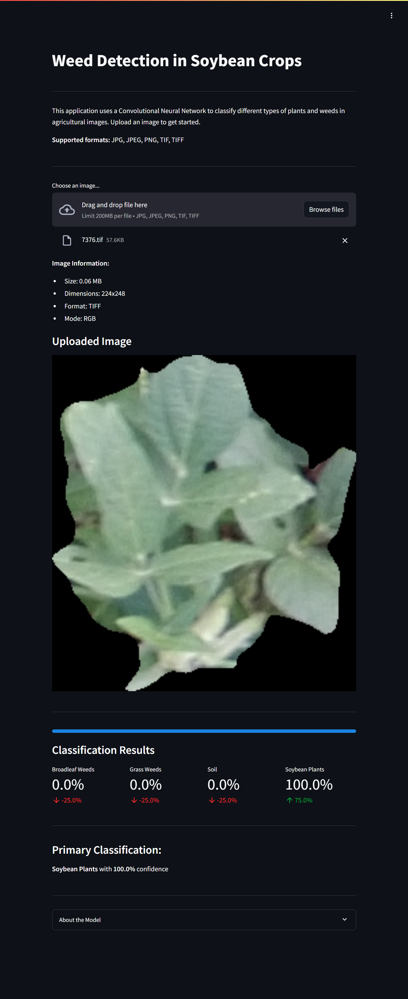

# Weed Detection in Soybean Crops



## Project Overview

The Weed Detection in Soybean Crops project is an interactive web application that performs real-time classification of agricultural images to identify weeds and crops. Using a Convolutional Neural Network (CNN) trained on UAV (drone) captured images, it can distinguish between four classes: broadleaf weeds, grass weeds, soil, and soybean plants.

This project demonstrates practical applications of deep learning in agriculture, potentially helping farmers with automated weed detection and crop monitoring.

### Key Features

The system employs multiple techniques to ensure efficient and accurate classification:

1. **Deep Learning Model**
   - Custom CNN architecture
   - Mixed precision training for faster computation
   - Optimized for real-time inference

2. **Image Processing**
   - Automatic image resizing
   - RGB conversion
   - Normalization

3. **Interactive Interface**
   - Real-time classification
   - Confidence metrics
   - Progress visualization

## Table of Contents

1. [Dataset](#dataset)
2. [Features](#features)
3. [Streamlit Application](#streamlit-application)
4. [Model Architecture](#model-architecture)
5. [Deployment Options](#deployment-options)
6. [File Structure](#file-structure)
7. [Usage](#usage)
8. [License](#license)

## Dataset

The project uses the [Weed Detection in Soybean Crops Dataset](https://www.kaggle.com/datasets/fpeccia/weed-detection-in-soybean-crops) from Kaggle:

- Total segments: 15,336
  - Soil: 3,249 samples
  - Soybean: 7,376 samples
  - Grass weeds: 3,520 samples
  - Broadleaf weeds: 1,191 samples

The dataset was created from UAV images and segmented using the SLIC algorithm through Pynovisão software.

## Features

- Intuitive image upload interface
- Real-time classification
- Support for multiple image formats:
  - JPG/JPEG
  - PNG
  - TIF/TIFF
- Comprehensive result visualization:
  - Class probabilities
  - Confidence metrics
  - Image information display

## Streamlit Application

The application (`app/app.py`) provides:
- Simple drag-and-drop image upload
- Automatic image preprocessing
- Real-time classification
- Clear visualization of results
- Detailed image information

## Model Architecture

The CNN architecture includes:
- Input size: 128x128x3
- 4 Convolutional blocks with increasing filters (16->32)
- MaxPooling layers
- Dense layers with dropout
- Softmax output for 4 classes

### Preprocessing and Optimization

1. **Image Preprocessing**
   - Resize to 128x128 pixels
   - RGB conversion
   - Normalization (0-1 range)

2. **Training Optimizations**
   - Mixed precision training (float16)
   - Batch size optimization (512)
   - GPU acceleration
   - Cached data loading
   - Efficient data pipeline with tf.data

## Deployment Options

### 1. Local Deployment
```bash
git clone https://github.com/pouryare/weed-detection-in-soybean-crops.git
cd weed-detection-in-soybean-crops/app
python -m venv venv
source venv/bin/activate  # On Windows use `venv\Scripts\activate`
pip install -r requirements.txt
streamlit run app.py
```
Access at `http://localhost:8501`

### 2. Docker Deployment
Two options:

a) Pull and run the pre-built image:
```bash
docker pull pouryare/weed:latest
docker run -p 8501:8501 pouryare/weed:latest
```

b) Build and run locally:
```bash
cd app
docker build -t weed:latest .
docker run -p 8501:8501 weed:latest
```

### 3. Heroku Deployment
```bash
heroku login
heroku create weed-detection
heroku buildpacks:add --index 1 heroku/python
heroku buildpacks:add --index 2 https://github.com/heroku/heroku-buildpack-apt
git push heroku main
```

### 4. AWS EC2 Deployment
1. Connect to EC2:
```bash
ssh -i your-key.pem ec2-user@your-instance-ip
```

2. Install dependencies:
```bash
sudo yum update -y
sudo yum install git python3 python3-pip -y
```

3. Setup application:
```bash
git clone https://github.com/pouryare/weed-detection-in-soybean-crops.git
cd weed-detection-in-soybean-crops/app
pip3 install -r requirements.txt
streamlit run app.py
```

### 5. Google Cloud Platform Deployment
```bash
gcloud init
gcloud app create
gcloud app deploy
gcloud app browse
```

### 6. Microsoft Azure Deployment
```bash
az webapp create --resource-group myResourceGroup \
                 --plan myAppServicePlan \
                 --name weed-detection \
                 --runtime "PYTHON|3.8"

az webapp deployment source config \
    --name weed-detection \
    --resource-group myResourceGroup \
    --repo-url https://github.com/pouryare/weed-detection-in-soybean-crops.git \
    --branch main \
    --manual-integration
```

## File Structure
```
weed-detection-in-soybean-crops/
├── app/
│   ├── app.py
│   ├── app.yaml
│   ├── Dockerfile
│   ├── Procfile
│   ├── requirements.txt
│   ├── setup.py
│   ├── setup.sh
│   └── weed_detection.keras
├── weed_detection_in_soybean_crops.ipynb
└── screenshot.png
```

## Usage

1. Access the application through your preferred deployment method
2. Upload an image in supported format (JPG, PNG, TIF)
3. Wait for automatic processing
4. View classification results:
   - Class probabilities
   - Confidence metrics
   - Image information

## License

This project is licensed under the MIT License. See the [MIT License](https://opensource.org/licenses/MIT) page for details.

## Acknowledgements

Dataset created by Alessandro dos Santos Ferreira, Hemerson Pistori, Daniel Matte Freitas, and Gercina Gonçalves da Silva. Distributed under the CC BY NC 3.0 license.

DOI: 10.17632/3fmjm7ncc6.2

---

For issues or suggestions, please open an issue on the [GitHub repository](https://github.com/pouryare/weed-detection-in-soybean-crops).

This project demonstrates the application of deep learning in agricultural automation. Through an intuitive interface and efficient processing, it provides real-time weed detection capabilities that can assist in precision agriculture and crop management.